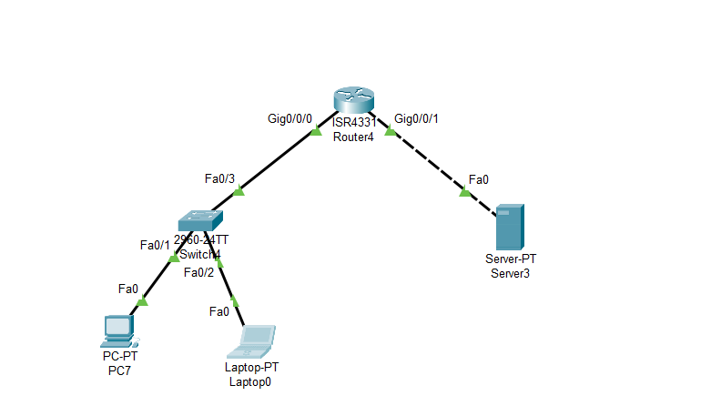

# Access Control Lists (ACL) Configuration — Cisco Packet Tracer Lab

This project demonstrates the configuration and testing of **Access Control Lists (ACL)** in **Cisco Packet Tracer**.  
The purpose of this lab is to apply both **Standard** and **Extended ACLs** to manage and secure network traffic by allowing or denying specific access between devices.

---

## 📘 Overview

Access Control Lists (ACLs) are a fundamental part of network security.  
They define which hosts or networks are permitted or denied access through a router interface.  
In this lab:
- The **PC** is allowed to access the web server.
- The **Laptop** is blocked (ping and HTTP requests are unreachable).  
This validates proper ACL filtering and network security policy enforcement.

---

## 🧩 Network Topology

The topology consists of three routers connected to end devices (a PC, a Laptop) and a web/DNS server.  
Routing and ACLs are configured to demonstrate real-world access control behavior.

### 📷 Network Diagram


---

## 📸 Screenshots

Below are screenshots captured from Cisco Packet Tracer showing ACL implementation and test results.

### 🔹 Router Configurations
  
  


### 🔹 Ping & Web Access Tests
**From PC (Allowed):**


**From Laptop (Denied / Unreachable):**


---

## ⚙️ Tools Used
- **Cisco Packet Tracer**
- **Router & Switch CLI Configuration**
- **Basic ICMP (ping) and HTTP testing**

---

## 💻 Full ACL Configuration

Below are the full ACL commands applied to enforce the access policy.

### 🔹 Standard ACL Example
```bash
Router(config)# access-list 10 permit 192.168.10.2
Router(config)# access-list 10 deny any
Router(config)# interface fa0/0
Router(config-if)# ip access-group 10 in

```bash
exampel :
Router(config)# access-list 100 permit ip 192.168.10.0 0.0.0.255 192.168.1.0 0.0.0.255
Router(config)# access-list 100 deny ip 192.168.10.3 0.0.0.0 192.168.1.0 0.0.0.255
Router(config)# interface fa0/1
Router(config-if)# ip access-group 100 out
